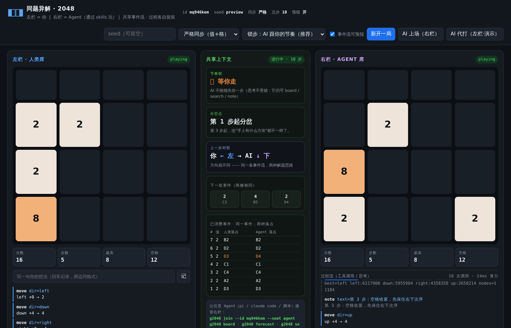

# 同题异解 · 2048 双栏对战 (Duel 2048)

   

<p align="center">
  
</p>
<p align="center">
  <em>左栏 = 你，右栏 = Agent（通过 skills 玩）。同一事件流、不同棋盘、不一样的过程。</em>
</p>

左栏是你，右栏是用 **agent skills** 玩的 AI。
**同样的上下文、同样的难题，但过程完全不同。**

```
┌───────────────────┬────────────┬───────────────────┐
│  左栏 · 人类席     │  共享上下文 │  右栏 · Agent 席    │
│  棋盘 / 分数 / 步数 │  节奏锁仪表  │  棋盘 / 分数 / 步数  │
│  我的想法（/ 键）   │  分岔点仪表  │  工具调用 / 思考流   │
│                   │  上一步对照  │                   │
└───────────────────┴────────────┴───────────────────┘
        同一条事件流 ↑            ↑ 同一套工具协议
```

## 快速开始

```bash
cd /home/leo/code/0929
node src/server/server.js          # 启动，零依赖，无需 npm install
# → http://localhost:5173
```

三个玩法入口：

| 你想干什么 | 怎么做 |
|---|---|
| 我一个人先玩 | 打开网页，方向键 / WASD 移动 |
| 跟内置 AI 对战 | 网页点「AI 上场（右栏）」 |
| 先看懂机制（自动演示） | 网页点「AI 代打（左栏）」，两边 AI 轮流走 |
| 跟任意真·Agent（LLM）对战 | 见下面「接入你的 Agent」 |

```bash
npm test                                   # 19 条测试（含 8 条节奏锁）
node bots/heuristic.js --bench --depth 2    # 离线标定 AI 强度
npx wrangler dev                           # 用 Workers 运行时本地跑（部署前验证）
npx wrangler deploy                        # 发布到 Cloudflare（见 docs/DEPLOY.md）
npm run preview                            # 重新生成 README 预览图（需 Chromium+系统依赖）
```

## 节奏锁（默认开启）

**你走一步，AI 才能走一步。** 否则你思考的时候它已经跑掉 200 步，根本来不及观察。

- 上方 `节奏` 选「锁步」/「自由」
- AI 抢跑会被拦下，并在右栏留下一条橙色 `⛓ 被节奏锁拦住`
- **锁的只是落子，不锁思考**：AI 随时可以 `board / search / forecast / note`，
  你会看到它在你思考时已经把候选算好了

## 接入你的 Agent（pi / Claude Code / 任何能跑 shell 的 harness）

Agent 席不读内存、不改状态，只能通过 `g2048` 这个 CLI 的工具玩 —— 这就是「skill 协议」。

```bash
# 1) 网页点「新开一局」，从地址栏 hash 拿到 matchId
# 2) Agent 侧
g2048 turn                     # 先问：轮到我了吗？（锁步模式下必须等人类先走）
g2048 board                     # 看自己的棋盘
g2048 forecast --n 3            # 预报共享事件流（和人类看到的是同一批）
g2048 search --depth 3          # 期望极大搜索：拿最佳方向 + 各方向分数
g2048 note "把 128 锁在右下角"    # 写一句思考 → 实时显示在右栏
g2048 move left                 # 走一步（也接受 w/a/s/d）
g2048 status                    # 双方状态 + 分岔点
```

完整的 agent 手册在 `skills/2048-duel/SKILL.md`，把它拷进你的 skills 目录即可。

## 这个游戏在玩什么

**不是**「比谁分数高」。是让你亲眼看到两种智能在同一道题上的分岔：

- **同样**：同一条事件流（值+格）→ 两边拿到的运气、难度完全一致
- **不同**：你用直觉和手感，它用工具和算力；你一步一个决定，它一步 5 次调用

中栏那张「已消费事件 · 同一事件，两种落点」表就是「同样」的证据；
右栏那条工具调用流就是「不同」的证据。

### 三个可调的胜负轴

| 轴 | 怎么玩 | 看什么 |
|---|---|---|
| 算力 | Agent 只能用 `legal_moves`（不许 `search`）| 你能赢吗 |
| 信息 | 关掉事件流预报 / 开 `crossSeat` 偷看人类棋盘 | 信息不对称怎么改写策略 |
| 时间 | 人类每步限时 3s vs Agent 算 200ms | 深度 vs 直觉 |

## 目录

```
src/core/rng.js       确定性随机（整局可复现）
src/core/stream.js    ★ 共享事件流 + 就近落子（"同样的上下文"的地基）
src/core/g2048.js     2048 规则内核（纯函数）
src/core/eval.js      评估函数 + 期望极大搜索（可预算、可复现）
src/core/match.js     ★ 双座位、节奏锁、分岔点、挑战事件、过程留痕
src/core/tools.js     ★ Skill 协议：Agent 能看到的全部世界
src/server/server.js  权威世界（唯一写入者）+ SSE
worker/               同一套逻辑的 Cloudflare Workers + Durable Objects 版
public/               双栏 UI
cli/g2048.js          Agent 席工具 CLI
bots/heuristic.js     内置对手 / 离线基准 / 双席演示
skills/2048-duel/     Agent 的 SKILL.md
docs/DESIGN.md        策划案
docs/ARCHITECTURE.md  实现方案与扩展路线
docs/DEPLOY.md        Cloudflare 部署
```

详细策划见 `docs/DESIGN.md`，工程方案见 `docs/ARCHITECTURE.md`。
